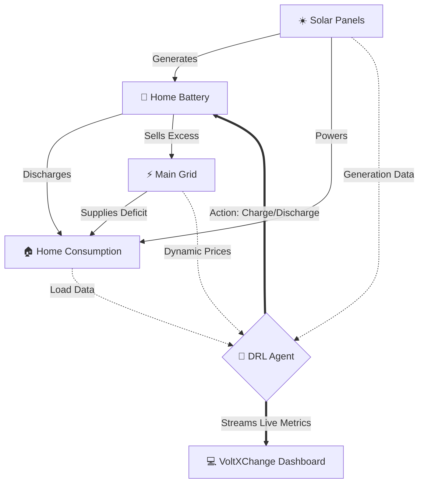

<<<<<<< HEAD
# ⚡ VoltXChange: Smart Home Energy Trading with DRL

🌍 **Live Application:** [https://voltxchange-ag37.onrender.com](https://voltxchange-ag37.onrender.com)
*(Login: `admin` / `123`)*

**VoltXChange** is an advanced, AI-powered energy management simulation and web application. Built upon a foundation of Deep Reinforcement Learning (DRL), it optimizes smart home energy usage by autonomously managing a home battery system. 

The agent learns to hoard locally generated solar power, discharge during peak grid pricing, and even sell excess energy back to the grid for profit (Net Metering), all visualized through a sleek, real-time dashboard.

---

## 🎯 Project Objectives

1. **Minimize Grid Dependency:** Maximize the utilization of locally generated renewable energy (Solar).
2. **Cost Optimization:** Exploit dynamic electricity market pricing (buy low, sell high).
3. **Autonomous Trading:** Utilize a Deep Q-Network (DQN) to discover the most profitable battery charging/discharging policies without human intervention.
4. **Real-time Analytics:** Provide a visually stunning web interface to monitor grid costs, solar battery charge, cost savings, and energy exports.

---

## 🧠 System Architecture & Workflow

The system relies on a custom-built RL environment where the Agent observes real-time energy demands and market prices, deciding whether to **Charge**, **Discharge**, or remain **Idle**.



---

## 🚀 Installation & Local Setup

Clone the repository to your local machine:
```bash
git clone https://github.com/YOUR_USERNAME/YOUR_REPO_NAME.git
cd YOUR_REPO_NAME
```

### Dependencies
This project requires Python 3. Install the required packages via `pip`:
```bash
pip install -r requirements.txt
```

### Running the App Locally
Start the Flask web server:
```bash
python app.py
```
* Open your browser and navigate to `http://127.0.0.1:5000`.
* **Login Credentials**: Username: `admin` | Password: `123`

---

## ☁️ Deployment (Render)

This project is fully configured to be deployed on [Render.com](https://render.com) for free.
1. Create a new **Web Service** on Render.
2. Connect this GitHub repository.
3. Render will automatically detect the `requirements.txt` and `Procfile`.
4. Render will start the application using `gunicorn app:app`.
5. Your SQLite database is automatically generated upon the first successful deployment!

---

## ⚙️ How It Works Under the Hood

### 1. The Environment (`env.py`)
Built similarly to Gymnasium environments, it defines the physics of the smart home. 
* Enforces solar-only charging.
* Calculates uncapped grid usage (allowing for negative usage/profit when selling back to the grid).
* Employs **extreme reward shaping** to ensure the DQN agent learns profitable actions in as few as 5 training episodes.

### 2. The Agent (`dqn.py` & `HEMS.py`)
A Deep Q-Network algorithm that stores transition states and updates neural weights to maximize long-term rewards. The `HEMS.py` manager orchestrates the interaction between the environment and the DQN agent.

### 3. The Dashboard (`app.py` & `index.html`)
A Flask API backend paired with a modern Tailwind CSS + Chart.js frontend. It exposes endpoints to trigger training iterations and run live tests, updating the UI dynamically.

---

## 📁 Folder Structure

```text
VoltXChange/
│
├── app.py                  # Main Flask Web Server & API
├── dqn.py                  # Deep Q-Network Architecture
├── env.py                  # Reinforcement Learning Environment Physics
├── HEMS.py                 # Simulation Manager (Train/Test Orchestration)
├── requirements.txt        # Python Dependencies
├── Procfile                # Render Deployment Config
├── dqn_model.pth           # Saved pre-trained Neural Network Weights
│
├── data/
│   └── rtp.csv             # Historical Energy Pricing & Usage Dataset
│
├── static/
│   └── script.js           # Frontend Logic & Chart.js rendering
│
└── templates/
    ├── login.html          # Authentication UI
    └── index.html          # Main Dashboard UI (Tailwind CSS)
```

---

## 📜 Citation & Original Research

This project builds upon the academic research on Smart Home Energy Management. If you use the underlying datasets or base RL scripts in your research, please cite the original paper:

[Matic Pokorn, Mihael Mohorčič, Andrej Čampa, and Jernej Hribar (2023). Smart Home Energy Cost Minimisation Using Energy Trading with Deep Reinforcement Learning](https://dl.acm.org/doi/10.1145/3600100.3625684)

```bibtex
@inproceedings{10.1145/3600100.3625684,
author = {Pokorn, Matic and Mohor\v{c}i\v{c}, Mihael and \v{C}ampa, Andrej and Hribar, Jernej},
title = {Smart Home Energy Cost Minimisation Using Energy Trading with Deep Reinforcement Learning},
year = {2023},
publisher = {Association for Computing Machinery},
url = {https://doi.org/10.1145/3600100.3625684},
doi = {10.1145/3600100.3625684},
booktitle = {Proceedings of the 10th ACM International Conference on Systems for Energy-Efficient Buildings, Cities, and Transportation},
}
```

## 📄 License
Copyright 2023 Matic Pokorn. The base algorithms in this project are licensed under the MIT license. Modified and expanded for web deployment and visual analytics.
=======
# voltXchange-system
Project on home autonomus energy trading
>>>>>>> db65e726b1a8f2084bb240295bc74f299d3fb893
